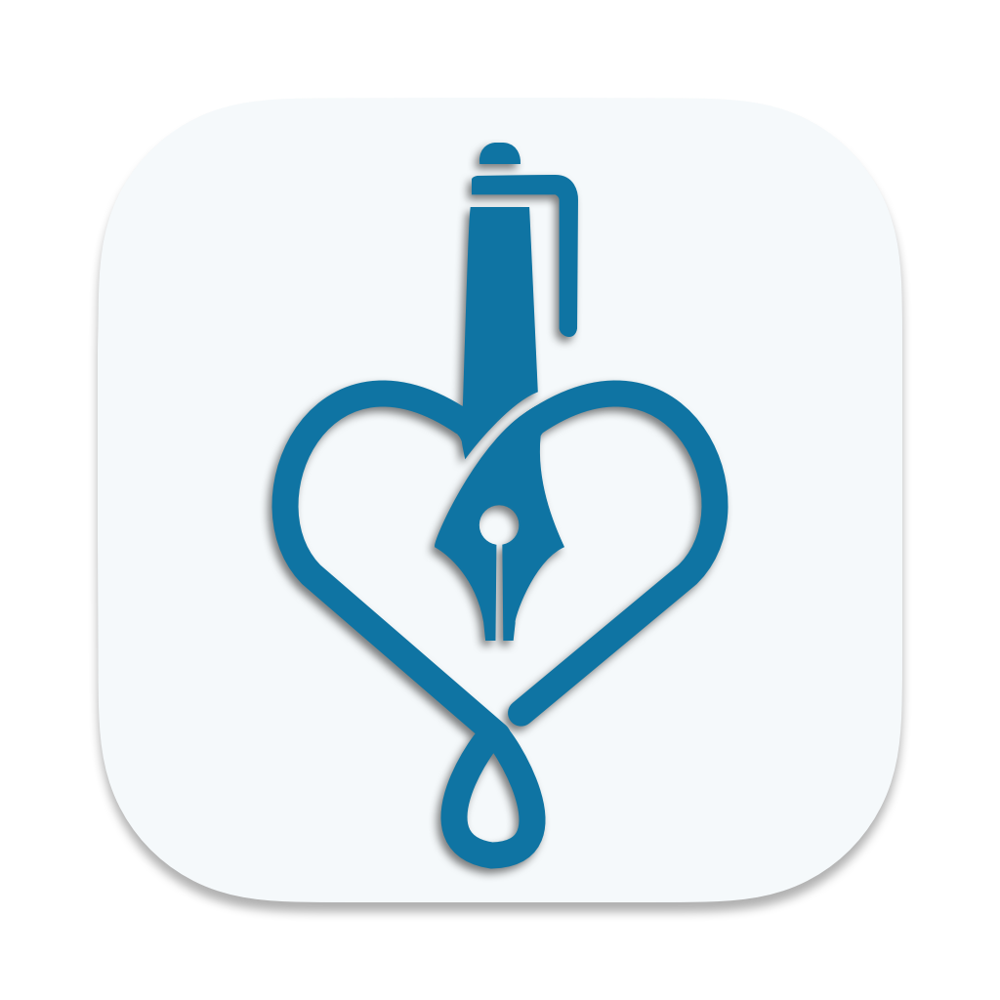

# MedScrybe

<p align="center">
  
</p>

MedScrybe is a local application that allows  medical practitioners to write their patient notes in a more efficient manner by taking advantage of local LLMs.

## Installation
```
npm install
```

## Running

This is a Tauri application utilizing Next.js. Tauri is a framework for building desktop applications with web technologies similar to Electron, but with a focus on security and performance.

```
npm run tauri dev
```
